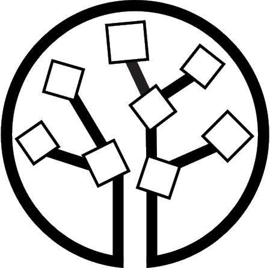

#  synthpop with disclosure functions

### for more information about _synthpop_ you can visit **[www.synthpop.org](www.synthpop.org)**. Look under resources for materials from our courses on how to use the package.

### This is a new version (v1.8-1) of the synthpop package.

### The version on CRAN is 1.8-0 as of 6/2/2024.

### You can find it here **[_synthpop_ on CRAN](https://CRAN.R-project.org/package=synthpop)**.

The biggest change in the new version is the inclusion of two new functions to assess the disclosure risk of synthetic data, disclosure() and disclosure.summary().

Each of them can take as input either an oject of class synds that includes synthetic data set(s) created by synthpop or a synthetic data set or a list of synthetic data sets created by any method from the same original data.

These are described in the vignette disclosure.pdf.

To install the package from this repo in Rstudio use the command

devtools::install_github("Gillian_Raab/synthpop",build_vignettes = TRUE)
If you then go to the package index you will see the documentation file 
disclosure.pdf in the vignettes directory,
 
 
## Other changes include :
 
 Adding Gaussian DP noise in the DP versions of syn.catall and syn.ipf
 
 Extending syn.ipf to allow all 3-way or 4-way interactions as a group option
 
 New function mergelevels.syn for grouping small levels of factors
 

## Acknowledgements

Help from MA

